# LDA topic modelling of outbreak reports

## Quick Build
```bash
python3 __main__.py --corpus '../Documents/documents_1996-2019.txt'
```
> nb. Input document assumes one document per line.

## Optimisation
```bash
python3 __main__.py --corpus '../Documents/documents_1996-2019.txt' --run_types OPTIMISE
```

|     |
| --- |
| [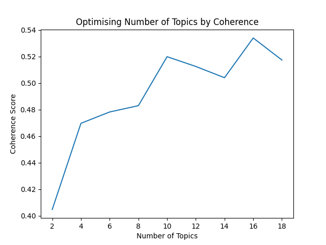](./Examples/coherence_by_num_topics.png) |

## Exploration
### Word Clouds
```bash
python3 __main__.py --corpus 'training_documents.txt' --explorations WORDCLOUDS
```
|     |     |
| --- | --- |
| [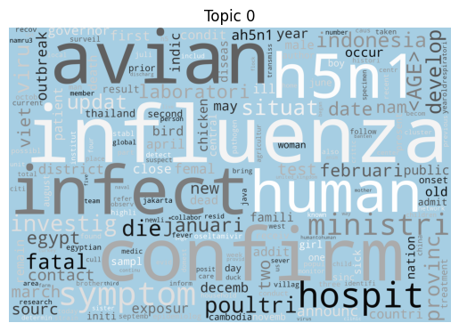](./Examples/wordcloud_topic_0.png) | [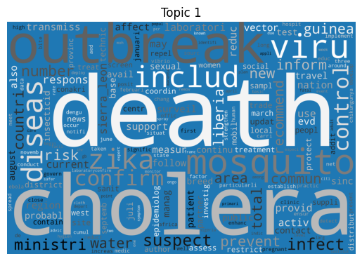](./Examples/wordcloud_topic_1.png) |
| [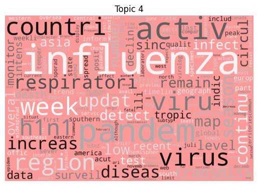](./Examples/wordcloud_topic_4.png) | [](./Examples/wordcloud_topic_5.png) |

### Word Bars
```bash
python3 __main__.py --corpus 'training_documents.txt' --explorations WORD_BARS
```
|     |     |
| --- | --- |
| [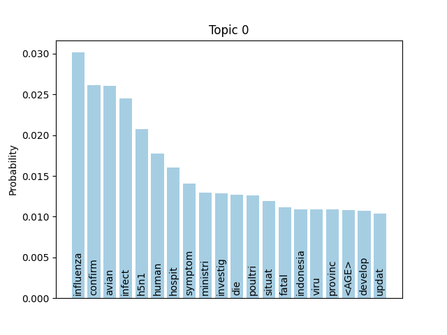](./Examples/word_bars_topic_0.png) | [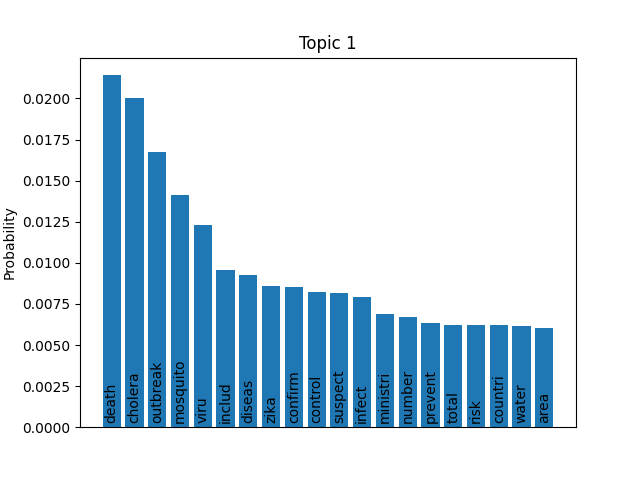](./Examples/word_bars_topic_1.png) |
| [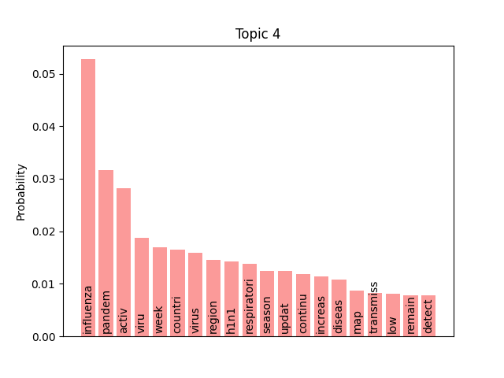](./Examples/word_bars_topic_4.png) | [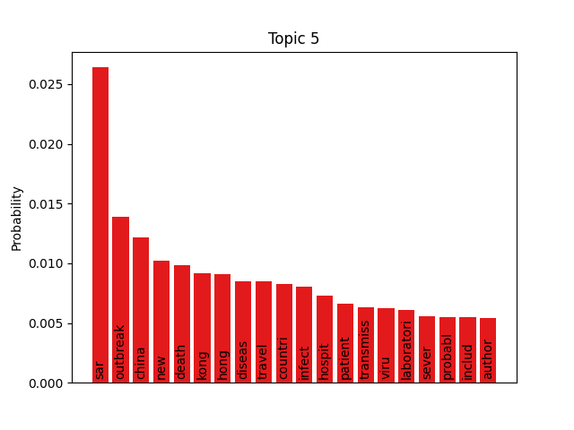](./Examples/word_bars_topic_5.png) |

### Clustering
```bash
python3 __main__.py --corpus 'training_documents.txt' --explorations PCA TSNE
```
|     |     |
| --- | --- |
| [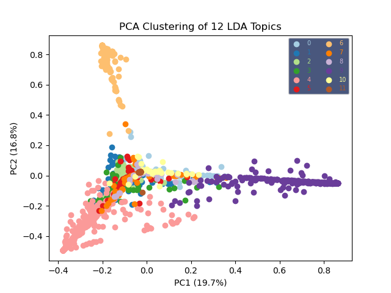](./Examples/pca.png) | [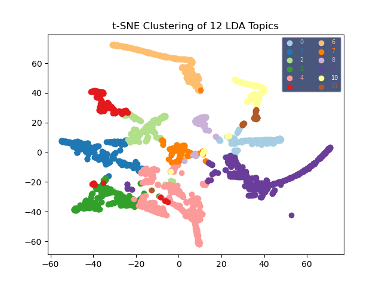](./Examples/tsne.png) |

### Topics by Document
```bash
python3 __main__.py --corpus 'training_documents.txt' --explorations DOC_TOPICS
```

|     |
| --- |
| [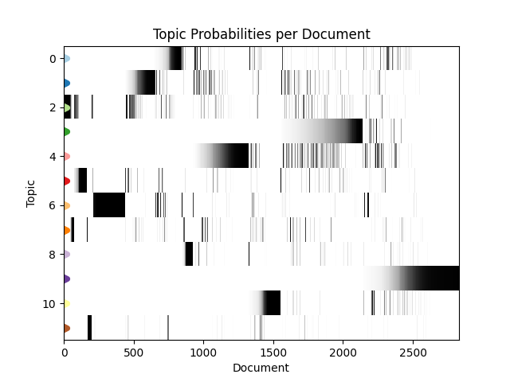](./Examples/doc_topics.png) |

### pyLDAvis
```bash
python3 __main__.py --corpus 'training_documents.txt' --explorations PYLDAVIS
```

### Representative Documents
```bash
python3 __main__.py --corpus 'training_documents.txt' --explorations REP_DOCS
```

### Topic Prediction
```bash
python3 __main__.py --corpus 'training_documents.txt' --predict 'document_for_prediction.txt'
```
> nb. Input document assumes one document per line.

More info can be found in an accompanying [blog post](https://mattravenhall.github.io/2021/10/01/Topic-Modelling-Disease-Outbreak-News.html).
